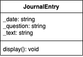
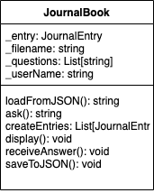
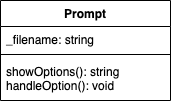

# Program Specification

This Journal program helps beginners to maintain a journaling habit. It is designed to smooth out the process of starting a journal by asking random questions about feelings, recent tasks, and things that can be done better. The user can choose between loading a journal file, displaying it to review, answering a random question to record an entry, saving answers into a file, and ending the program.

## Classes definition

### JournalEntry

__object__: JournalEntry

__Resonsibility:__
* to hold and display a single journal entry information

__Behaviors:__
* display the journal entry as a string, together with the date it was saved in the following format
    > Date: 2023/01/01 - Prompt: {Question asked}
    >       {Answer to the question}

__Attributes:__
* date: *string*
* question: *string*
* text: *string*

### JournalBook

__object__: JournalBook

__Resonsibility:__
* keeps track of user's information, available questions to ask, and list of journal entries
  
__Behaviors:__
* load from a JSON file, and unpack it into entry strings, questions strings, and user information strings
* create journalEntry objects from the entry strings
* ask the user a random question
* display all entries by using each entry object display method
* receive a text from the user and save it into the file
* iterate over the objects to create a dictionary and save it into a JSON file

__Attributes:__
* entry: *JournalEntry*
* filename: *string*
* questions: *List(string)*
* userName: *string*

### Prompt

__object:__ Prompt

__Responsibility:__
* Show options for writing an entry, displaying all entries, loading from the file, saving the entry, and quit
* for writing the entry, give control to JournalBook so that it can ask a question and save the entry
* for display all entries, give control do JournalBook
* for loading from file, give control to the JournalBook instance to load the file 
* for save an entry, give control to JournalBook so that it can save the entry into the file
* for quit, terminate the program

__Attributes:__
* filename: *string*

## Basic flux

The program starts by calling to Prompt, which will ask the user the option to follow. According to the chosen option, the program can be terminated, or the control of the program will be given to a JournalBook object to load a file, display the entries, or ask for an entry. The JournalBook will use instances of JournalEntry for storing entries or displaying purposes.