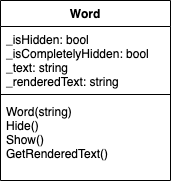
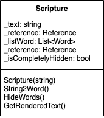
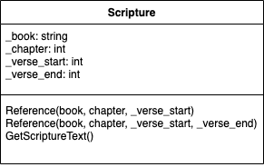

# Program Specification

The Scripture Memorizer program helps users to learn a scripture by making the user to remember the words that are not shown in the scripture. At a starting point, the user is presented with a scripture that he should memorize, then he can hit enter to prove his learning. The program will hide certain words randomly and replace them with blankspace or underscores. At the following levels, more words are hidden from the user as he continues pressing enter. In the end, all words are removed from the screen, and the program finishes. The program can also terminate if the user type *quit*.

## Classes definition

### Word

__object__: Word

__Resonsibility:__
* to hold a single word from a scripture. The rendered text can be either the full word, or each letter coudl be replaced with underscores depending on the `isHidden` attribute

__Behaviors:__
* `Word(string)`: The constructor receives a word as a string and save it into `_text`
* `Hide()`: Make `_isHidden = True`
* `Show()`: Make `_isHidden = False`
* `GetRenderedText()`: Depending on the `_isHidden` value, it will return either the text itself, or a series of underscores and save it into `_renderedText`

__Attributes:__
* `_isHidden`: *bool*
* `_isCompletelyHidden`: *bool*
* `_text`: *string*
* `_renderedText`: *string*

### Scripture

__object__: Scripture

__Resonsibility:__
* to hold a whole scripture and to show rendered versions of it whenever it is called to do that
  
__Behaviors:__
* `Scripture(Reference)`: The constructor is built using a `Reference` instance
* `String2Word()`: It converts a text string into a list of Word instances
* `HideWords()`: It chooses `Word` instances randomly to make them "hidden"
* `GetRenderedText()`: It retrieves rendered text from each `Word` instance, together with `reference` information
* `Display()`: The rendered text is shown into the screen in the following format:
    
    > {reference information} {rendered text with words replaced by underscores _____ if a word has been chosen}

__Attributes:__
* `_text`: *string*
* `_reference`: *Reference*
* `_listWord`: *List<Word>*
* `_reference`: *Reference*
* `_isCompletelyHidden`: *bool*

### Reference

__object:__ Reference

__Responsibility:__
* To hold reference's information and use it to  load and return a text scripture

__Behaviors:__
* `Reference(book, chapter, verse_start)`: Constructor for the case "John 3:16"
* `Reference(book, chapter, verse_start, verse_end)` Constructor for the case "Proverbs 3:5-6"
* `GetScriptureText()`: Load and return the required text scripture saved in the main program. It uses verses information `_verse_start:` and `_verse_end`

__Attributes:__
* `_book`: *string*
* `_chapter`: *int*
* `_verse_start`: *int*
* `_verse_end`: *int*

## Basic flux

The program starts by calling to `Reference` which will load an scripture. An appropriate constructor can be called depending on the number of verses. The program builds a `Scripture` instance to store `Reference`. From here, `Scripture` can retrieve the text scripture and build a list of `Word` instances. The program waits for the user to hit *Enter* or *"quit"*.

If the user hits *Enter*, the program calls `Scripture` to take control. `Scripture` will hide some words randomly by calling its `HideWords()` method and retrieve the rendered text from `GetRenderedText()`. If all the words are already picked up to be hidden, `HideWords()` will make `_isCompletelyHidden=True`. The rendered text will be combined with the reference information and displayed on the screen. If `_isCompletelyHidden=True` the `Scripture` instance will inform the main program about it to quit.

If the user types *quit*, the program ends.